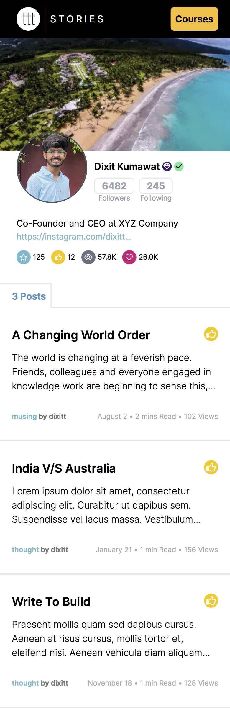

# STORIES | TTT

This repository contains a TTT Profile Page built using Next.js, with full responsiveness and Tailwind CSS for styling.

**Live Here:** [STORIES](https://tttstories.vercel.app/)


## Features

- Data fetching from JSON file.
- Fully responsive design.
- Used only **Tailwind CSS** for styling needs.

## Getting Started

### Prerequisites
- Node.js and npm installed on your local machine.

### Installation

1. Clone the repository: <br>
   `git clone https://github.com/dixit-kmt/ttt-stories.git`
2. Navigate to the project directory: <br>
   `cd ttt-stories`
3. Install dependencies <br>
   `npm install`
4. Run the development server: <br>
    `npm run dev`
5. Open `http://localhost:3000` in your browser

## Components
It consists of three components:
1. Navbar
2. User Details
3. Posts

### Navbar Component

It includes the logo and a button for accessing Courses.

### User Details Component
Features:
- Banner image with **Parallax effect**.
- Utilizes JSON data to showcase user subscription status and verification, along with basic user details (bio, followers, followings, etc.).

### Posts Component
This section displays:
- Post count and individual posts with titles and descriptions.
- Trims the post description after 3 lines.
- Details like post type, date, read time, and views are presented.

## JSON File

User-related information is retrieved from JSON data; here's an example structure or an explanation of the JSON schema.

```json 
{
    "username": "dixittt",
    "name": "Dixit Kumawat",
    "pro": true,
    "verified": true,
    "followers": 6482,
    "following": 245,
    "bio": "Co-Founder and CEO at XYZ Company",
    "instagram": "dixitt._",
    "stars": 125,
    "upvotes": 12,
    "views": "57.8K",
    "likes": "26.0K",
    "posts": [
        {
            "title" : "Title1",
            "description": "Description1",
            "type": "musing",
            "date": "August 2",
            "read": 2,
            "views": 102,
            "link": "/"
        },
        {
            "title" : "Title2",
            "description": "Description2",
            "type": "thought",
            "date": "January 21",
            "read": 1,
            "views": 156,
            "link": "/"
        }
    ]
}
```

## Dependencies

### FontAwesome
Utilized FontAwesome for the icons needed throughout the project.

### Tailwind CSS
Tailwind CSS is the primary utility-first CSS framework used in this project.


## Screenshot



